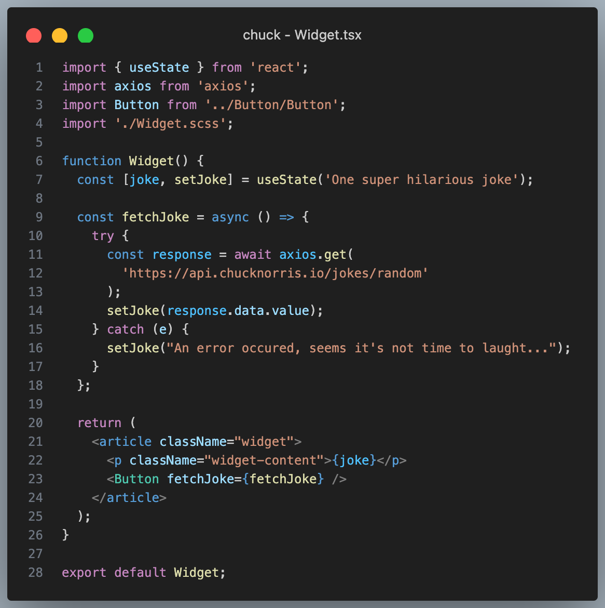
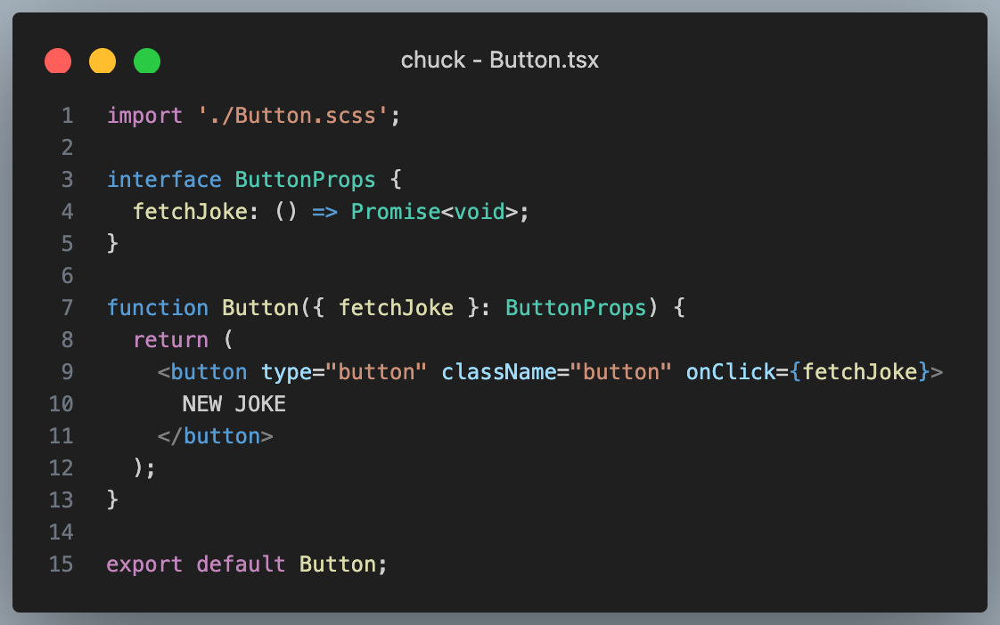
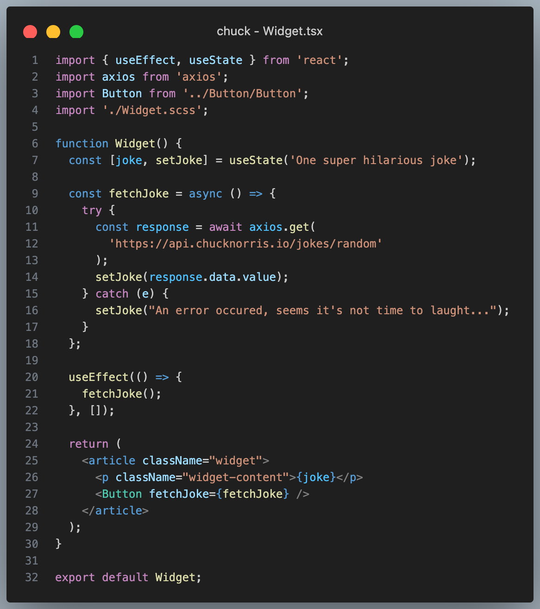
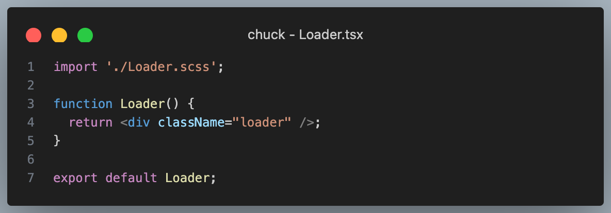
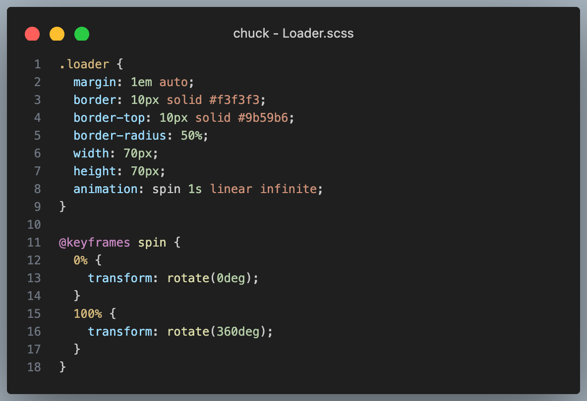

# O'Chuck Jokes - Appel API et useEffect

Ce projet contient déjà des composants statiques, analyse sa structure. On va le dynamiser en allant interroger une API.

## 1 - Affichage d'une nouvelle blague au clic sur le bouton
A chaque click sur le bouton, on veut afficher une nouvelle blague venant de l'api Chuck Norris. 
C'est une API publique dont tu trouveras la documentation ici : [https://api.chucknorris.io/](https://api.chucknorris.io/)

  
Etape guidée

  #### 1.1 - Stockage de la blague dans le state du composant `Widget`

  - Ajoute un état au composant Widget avec useState (initialisé avec la chaine de caractère `One super hilarious joke`)
  - Affiche dans le JSX la valeur de cet état au lieu de la blague en dur.

  #### 1.2 - Appel API au click

  - Installe `axios` avec `yarn`
  - Créé une fonction `fetchJokes` dans le composant `Widget`, dans cette fonction :
    - lance la requête avec axios (n'oublie pas de l'importer) vers l'url `https://api.chucknorris.io/jokes/random`
    - à reception de la réponse, mets à jour le state avec la blague reçue

  - Fais passer cette fonction au composant `Button` via une prop
  - Execute là au click sur le bouton.

  
Solution

  

  

  N'oublie pas d'installer axios : `yarn add axios`

## 2 - Affichage d'une blague dès le premier rendu
Dès qu'on arrive sur la page avant même d'avoir cliqué sur le bouton, on veut afficher une blague dans le composant Widget.

  
Etape guidée

#### 2.1 - Appel API au premier rendu
  Ajoute un useEffect dans le composant widget avec les paramètres suivants : 
  - la callback qui devra executer `fetchJokes`,
  - le tableau de dépendances vide qui indique qu'il faut executer la callback uniquement au premier rendu.

  
Solution

  

## Bonus

Affiche un loader en attendant que la blague soit reçue de l'API.

  
Etape guidée

  #### 1 - Création de l'état de loading dans le state
  Ajoute dans le composant Widget un état `isLoading` avec `useState` (initialisé à `true` puisque on sera en état de loading direct en arrivant sur la page)

  #### 2 - Modification de l'état de loading avant et après la requette
  - avant de faire l'appel API, passe sa valeur à `true`
  - quand l'appel est fini (succès OU erreur), passe sa valeur à `false` 

  #### 3 - Affichage conditionnel
  Utilise cet état pour faire un afffichage conditionnel :
  - si `true` : affiche un loader ou simplement le texte "joke loading ..."
  - si `false` : affiche la blague

  
Solution

  
  
  

